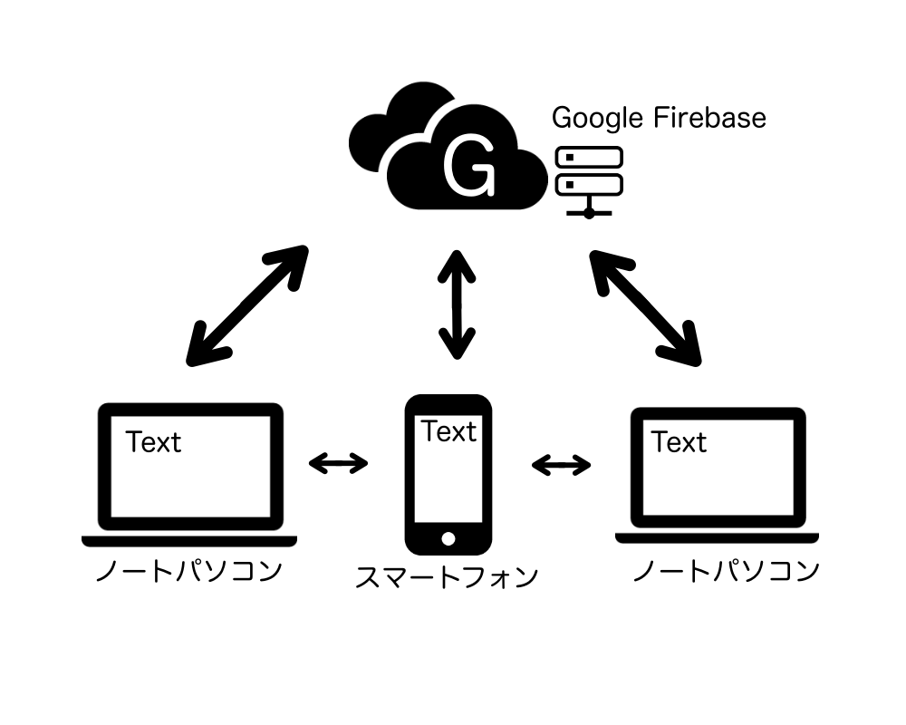

# FFNotePad

## 概要

今回開発するアプリケーションは Flutter、Firebase を用いたテキストデータ同期アプリケーションの開発になる。

### システム構成図

### 背景

Apple デバイス間ではユニバーサルクリップボードという機能がある。

ユニバーサルクリップボードを用いればクリップボードの内容が Apple デバイス間で簡単に同期ができるが、どういった内容をコピーしたのか分からなかったり、ときたまにテキストデータがきちんとコピーできなかったりする。

また、macOS、Windows、iOS、iPadOS、Android と主要なプラットフォーム間で容易にテキストデータが瞬時でリアルタイムで同期するアプリケーションが欲しいと思っていた。

### 定義

#### Flutter

Google が開発しているオープンソースのアプリケーションフレームワーク。

クロスプラットフォームに対応し、Android、iOS（iPadOS）、Web、Windows、macOS、Linux に対応したアプリケーションを作ることが可能。

https://flutter.dev/

#### Firebase

FirebaseGoogle が提供しているモバイル、および Web アプリケーションのバックエンドサービスかつ、ホスティングサービス。

提供しているサービスに Cloud Firestore という機能があり、これでリアルタイム同期が可能にする。

また、オフライン環境下でのデータの書き込み、読み取りを可能とする。

https://firebase.google.com

https://firebase.google.com/docs/firestore

#### PWA

Progressive Web Apps の略で、Web ページやWebアプリケーションの UX を向上を目的とした技術。

サイト上でネイティブで動くアプリケーションのような動作を提供できる。

## 業務要件

### 業務フロー

1.Flutter を用いてモバイル環境用のアプリケーションの開発

2.Firebase の環境を構築

3.Web 上にアプリケーションを公開

### 時期・時間

6,7,8月：Flutter、Firebase について勉強

9月：実践

10月：祭に向けた準備

11月：細かいところを修正

12月：完成予定

## 機能要件
##### 1.ログイン画面
1-1.メールアドレスとパスワードを入力してログインボタンを押下するとログインできる

1-2.ログインするとメモを追加できる画面に遷移する

1-3.新規登録ボタンを押下すると新規登録画面に遷移する

*lib/features/auth/presentation/login/login_page.dart*

##### 2.新規登録画面

2-1.名前、メールアドレス、パスワードを入力して、新規登録ボタンを押下するとメールアドレス宛に認証を求めるメールが届く

2-2.届いたメールのリンクにアクセスすると該当するメールアドレスが認証される

*lib/features/auth/presentation/signup/signup_page.dart*

##### 3.メイン画面

3-1.＋ボタンを押下するとテキスト入力画面に遷移する

3-2.ハンバーガーメニューを押下するとドロワーを表示する

*lib/features/notes/presentation/home/home_page.dart*

##### 4.ドロワー画面

4-1.ドロワー画面から [ダークテーマ]メニューを押下するとダークテーマになる

4-2.ドロワー画面から [ライトテーマ]メニューを押下するとライトテーマになる

4-3.[ログアウト]メニューを押下すると現在ログインしているアカウントからログアウトする

*lib/features/notes/presentation/home/widgets/drawer_layout.dart*

##### 5.テキスト入力画面

5-1.[タイトル]のテキストフィールドを押下するとタイトルが編集できる

5-2.[メモ]のテキストフィールドを押下するとメモが編集できる

5-3.[<]を押下すると入力されている文字を保存してメイン画面に遷移する

5-4.[📌]ボタンを押下するとメイン画面でメモが上部に固定される

5-5.[🎨]ボタンを押下するとメモの背景色を変更できるメニューウィンドウを表示する

5-6.[🗑]ボタンを押下するとテキスト入力画面に書いている内容を全て破棄したうえでメイン画面に遷移する

*lib/features/notes/presentation/editNote/edit_note_page.dart*

##### 6.メモの背景色を変更できるメニューウィンドウ

6-1.下記色からメモの背景色を選択できる。

（ダークテーマにした場合はダークモードに準じた色の選択が可能）

※デフォルトは Colors.grey(235,235,235) になっている

```
Colors.red(252,202,198)
Colors.pink(248,169,195)
Colors.purple(217,139,226)
Colors.deepPurple(189,167,225)
Colors.indigo(170,180,224)
Colors.blue(177,219,250)
Colors.lightBlue(143,220,253)
Colors.cyan(104,239,254)
Colors.teal(22,255,237)
Colors.green(180,223,185)
Colors.lightGreen(212,233,191)
Colors.lime(238,243,190)
Colors.yellow(254,250,213)
Colors.amber(255,231,164)
Colors.orange(255,214,156)
Colors.deepOrange(255,203,188)
Colors.brown(194,163,152)
Colors.grey(235,235,235)
Colors.blueGrey(183,198,205)
```

6-2.色のついた丸い色で囲った円を押下すると、[✅]が丸い色で囲った円の中に表示される

6-3.選択ボタンを押下するとメモの背景色が選択した色に変更される

*lib/core/utils/color_palette.dart*

##### 7.その他

6-1.同じアカウントでログインすると他の端末でも 5. で入力したメモが表示される

ff.note.test@gmail.com
PsC2JV-eHQ

